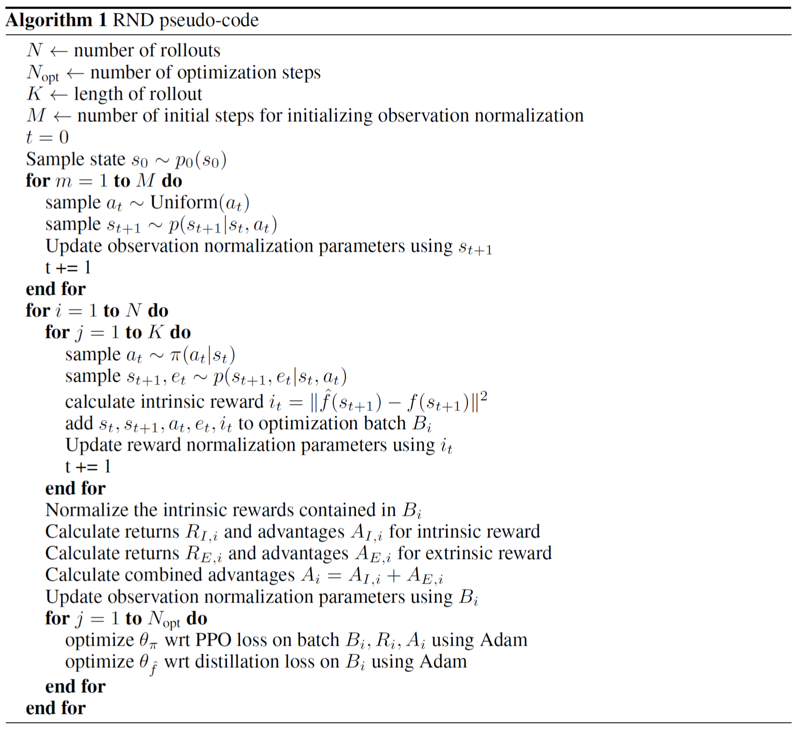

[//]: # (Image References)

[image1]: ./media/pong1.gif "Trained Agent"


# Random Network Distillation - PyTorch Implementation (in progress)

## Introduction

Using Montezuma’s Revenge environment you will train an agent via Random Network Distillation ([RND][ref1]) algorithm.  
<!-- ![Trained Agent][image1]-->
In this environment, the observation is an RGB image of the screen, which is an array of shape (210, 160, 3).
Given such information, the agent learns how to select best actions for maximizing the score. 

**18** discrete actions are available (see `get_action_meanings()`), such as

- **`0`** - 'NOOP'
- **`1`** - 'FIRE'
- **`2`** - 'RIGHT'
- **`3`** - 'LEFT'
- **`4`** - 'RIGHTFIRE'
- **`5`** - 'LEFTFIRE'


## Dependencies

- Python 3.6
- PyTorch 1.1.0
- OpenCV Python
- OpenAI Gym (for Installation, see [here](https://github.com/openai/gym#id8))

## Contents
- parallel_envs/

    -- `atari_wrappers.py` : [Taken from openai](https://github.com/openai/random-network-distillation/blob/master/atari_wrappers.py) with minor edits for PyTorch. (Framestack, ClipReward, etc.)

    -- `env_eval.py` : Wrapper for obtaining an original RGB frame and warped frame to 84x84. Mainly for visualization (see [test_env.ipynb](test_env.ipynb)).

    -- `monitor.py` : Recording rewards and episode lengths and so on.

    -- `make_atari.py` : Creating a wrapped, monitored SubprocVecEnv for Atari.

## Overview



<!-- 
## Instructions

- Before running code, change parameters in `train.py`, especially you must change `env_file_name` according to your environment.
- Run the following command to get started with training your own agent!
    ```bash
    python train.py
    ```
- After finishing training weights and scores are saved in the following folder `weights` and `scores` respectively. 
-->

<!-- 
## Tips

- For more details of algolithm description, hyperparameters settings and results, see [Report.md](Report.md).
- For the examples of training results, see [_Results_Example.ipynb](_Results_Example.ipynb).
- After training you can test the agent with saved weights in the folder `weights`, see [_Watch_Agent.ipynb](_Watch_Agent.ipynb). 

-->

## References

- [Y. Burda, et al. "Exploration by Random Network Distillation"][ref1]
- [openai blog : Reinforcement Learning with Prediction-Based Rewards][ref2]
- [openai code][ref3]
- [Y. Burda, et al. "Large-Scale Study of Curiosity-Driven Learning"][ref4], [(issues)][ref4-1]
- [On “solving” Montezuma’s Revenge (medium)][ref5]
- [RND-PyTorch (1)][ref6] / [(2)][ref6-1]
- [Obstacle Tower Environment][ref7] / [Alex Nichol Blog][ref7-1] 

[ref1]: https://arxiv.org/abs/1810.12894
[ref2]: https://openai.com/blog/reinforcement-learning-with-prediction-based-rewards/
[ref3]: https://github.com/openai/random-network-distillation
[ref4]: https://arxiv.org/abs/1808.04355
[ref4-1]: https://github.com/openai/large-scale-curiosity/issues/6
[ref5]: https://medium.com/@awjuliani/on-solving-montezumas-revenge-2146d83f0bc3
[ref6]: https://github.com/jcwleo/random-network-distillation-pytorch
[ref6-1]: https://github.com/wizdom13/RND-Pytorch
[ref7]: https://github.com/Unity-Technologies/obstacle-tower-env
[ref7-1]: https://blog.aqnichol.com/2019/07/24/competing-in-the-obstacle-tower-challenge/